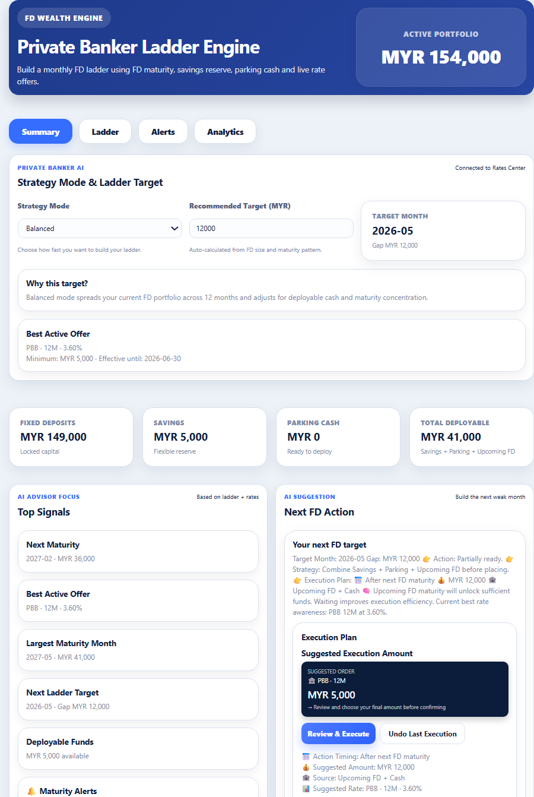
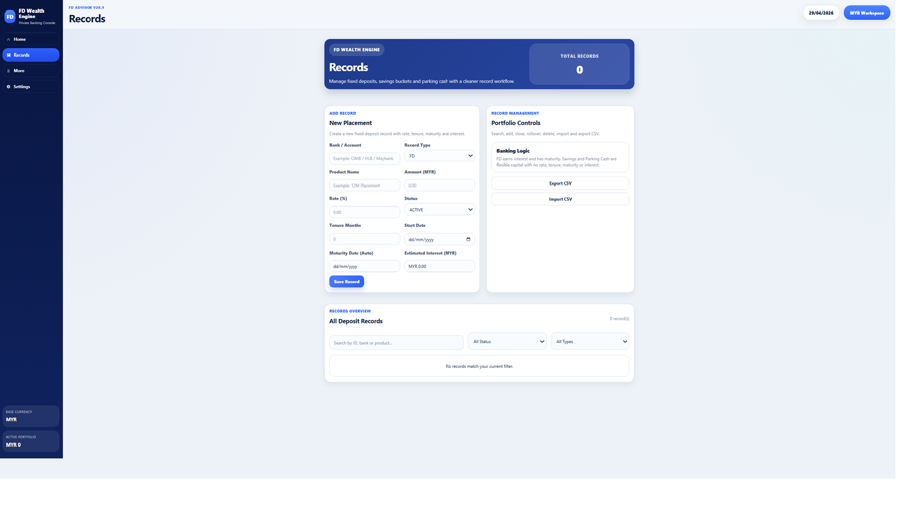
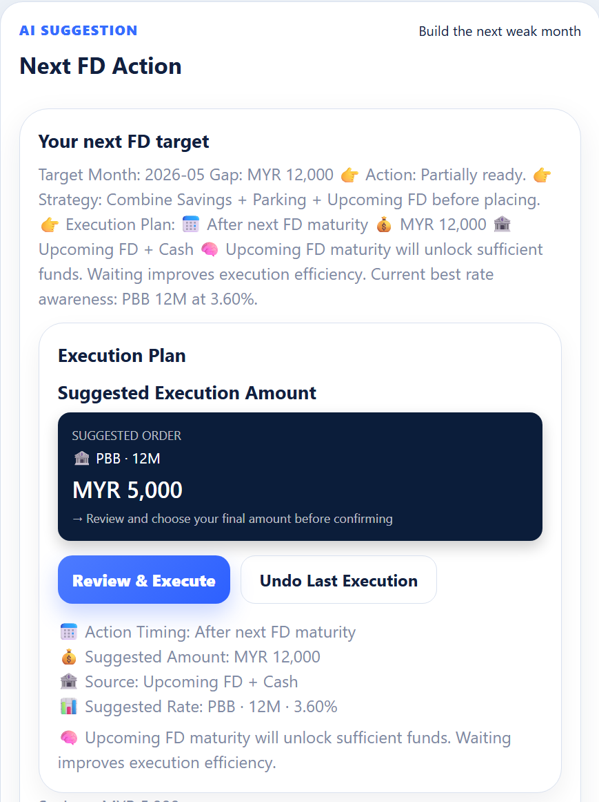

# 💰 FD Wealth Engine

### 🏦 Private Banking Console for Fixed Deposit Investors

A desktop app designed to help you **track, plan, and optimize your Fixed Deposit portfolio** with clarity and precision.

---

# 🚀 Download (Windows)

👉 **[Download Latest Version](https://github.com/stephanieho-ai/fd-wealth-engine-updates/releases/latest/download/FD.Wealth.Engine-Setup.exe)**

💡 No setup required — just download and run.

---

# 🖥️ App Preview

> *(Replace with your real screenshots later)*







---

# ✨ Key Features

### 📊 Portfolio Dashboard

* View all your FD in one place
* Track maturity timeline
* Monitor interest performance

---

### 🧾 Records Management

* Add / Edit / Close FD
* Support Savings & Parking Cash
* Auto ID generation (FD001, FD002…)

---

### 🧠 Smart FD Advisor (In Progress)

* Detect ladder gaps
* Suggest optimal placement
* Highlight strong / weak months

---

### ⚡ Execution Engine (V32 – Coming)

* One-click FD record generation
* Auto-select best bank offers
* Auto-fill start date & maturity date
* Convert plan → execution

🚧 Currently under active development

---

### 🌍 Multi-Currency Ready

* MYR, USD, SGD, EUR and more

---

# 📦 How to Install

1. Click the download link above
2. Open the `.exe` file
3. If Windows shows warning:
   → Click **More Info → Run anyway**
4. Done 🎉

---

# 🧠 Why FD Wealth Engine?

Most people:

* Track FD in Excel ❌
* Miss maturity timing ❌
* Don’t optimize interest ❌

FD Wealth Engine helps you:

* Think like a banker
* Plan systematically
* Execute with clarity

---

# 🔥 Latest Version

👉 Always download from:
https://github.com/stephanieho-ai/fd-wealth-engine-updates/releases

---

# 🛠️ Tech Stack

* React
* Vite
* Electron

---

# 👩‍💻 For Developers

```bash
npm install
npm run dev
```

---

# 💬 About

Built as a **personal wealth system** evolving into a **private banking execution tool**.

---
